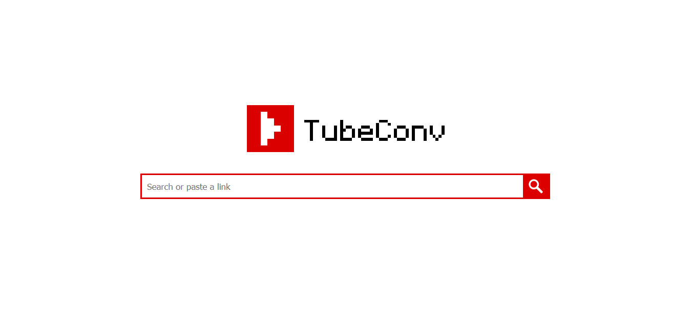
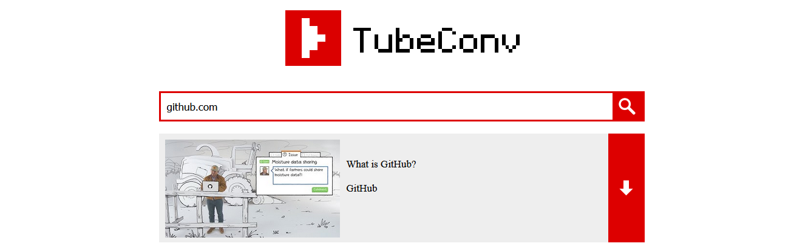
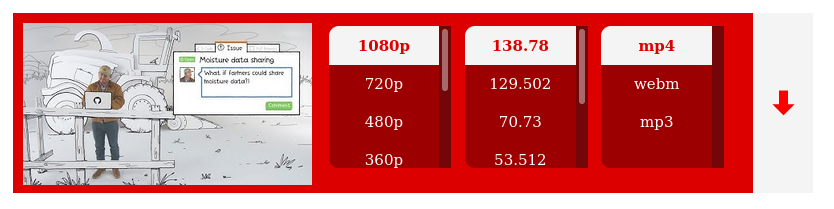
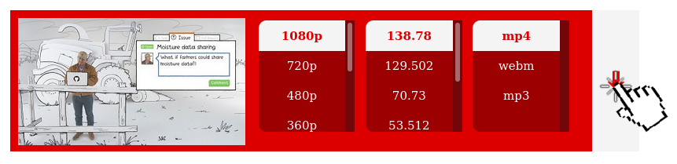

  <picture>
    <source
      srcset="res/dark_logo.png"
      media="(prefers-color-scheme: dark)">
    
  </picture>
  
  <h3 align="center">Modern YouTube converter, that combines simplicity and effectiveness.</h3>

  

  
  
  

  
  <h2 align="center">How to use it?</h2>

  <h3 align="center">Go to <a href="https://tubeconv.com" target="_blank">TubeConv.com</a><h3>
  
  
  <h3 align="center">Paste a link to a video, or use the search bar<h3>
  
  
  <h3 align="center">Choose the quality and video/audio format that suits you (by default the best quality is selected)<h3>
  
    
  <h3 align="center">Click the download button!</h3>
  
    
   
    
  <h2 align="center">Contributions</h2>
    We are open to any kind of contribution! 
    We think that every idea can be great, and it would be a pleasure for us to talk about it.
    
   
    
  <h2 align="center">To-Do List</h2>
  <ul>
    <li>More video/audio formats</li>
    <li>Add proper unit tests</li>
    <li>Basic video editing</li>
    <li>Video screenshoting</li>

  </ul> 

  

